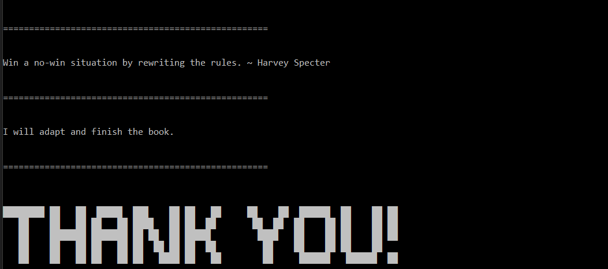

# mixed-messages

This repository contains a node.js script which will generate a random Harvey Specter quote, a random message and a 'Thank You' message(ASCII art).

---

## Technologies used

1. ES6 
2. Git and Github 
3. Terminal 

---

## How to run

1. Open `terminal` and make sure you have node installed using `node --version`.
2. Type `node script.js` and the output will be visible on the terminal.

---

## A sample output

---

